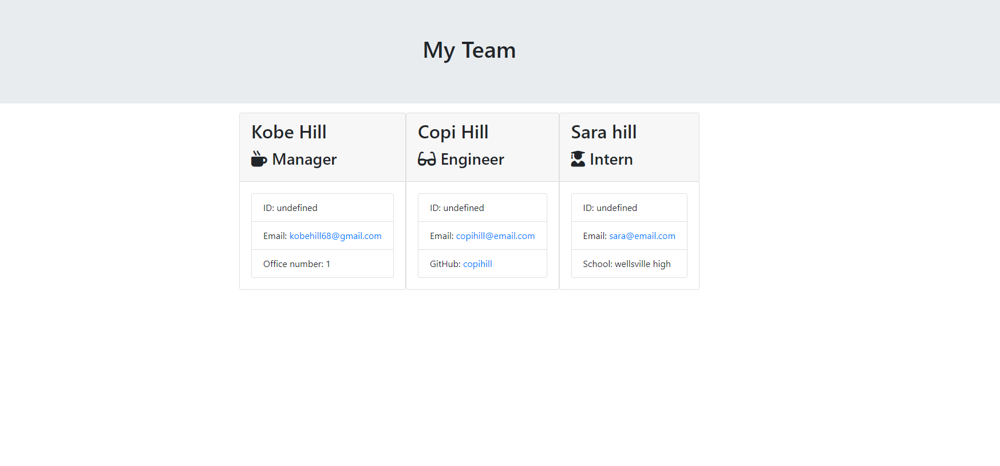

# 10-Employee-Summary

## Description
This is a Software engineering team generator that uses the commandline to render a team through inquirer prompts and then popilates
on a html page sytled with bootstrap. You can add a Manager, Engineer's, and Intern's each have a unique prompt, employee id, and email.

## User Story
As a manager:
I want to generate a webpage that displays my team's basic info
so that I have quick access to emails and GitHub profiles

## Instructions
Enter node app.js into the command line and follow the on screen prompts. Once that is completed open the output folder
and open the team.html file and you will see your generated team. I have linked a demo video so you can see how it works
with your own eyes. 

## Demo Video
This video will show you how to run the app.
https://drive.google.com/file/d/1czjd2dM6Bze8WFLr34WxEs9PLJ2z08-q/view

## Screenshot

## Srouces 
https://nodejs.org
&
https://jestjs.io/
&
https://www.google.com/

